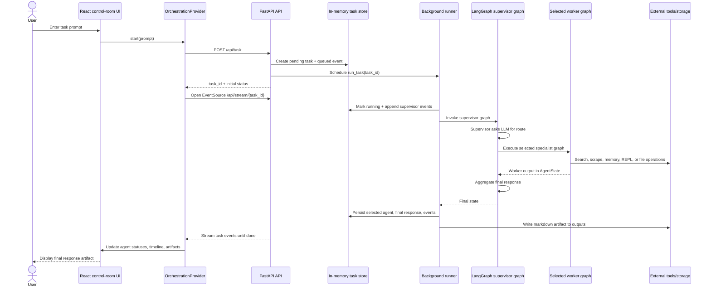

# Architecture Diagram

This project is a live multi-agent orchestration demo with a TanStack Start frontend, a FastAPI backend, and LangGraph-powered supervisor and worker graphs.

## System architecture

```mermaid
flowchart LR
  user([User])

  subgraph frontend["Frontend: TanStack Start / React"]
    ui["Control-room UI\nSidebar, timeline, artifacts panel"]
    provider["OrchestrationProvider\nTask lifecycle + EventSource client"]
    ui --> provider
  end

  subgraph backend["Backend: FastAPI API"]
    api["REST + SSE endpoints\n/api/task, /api/status, /api/results, /api/stream"]
    store[("In-memory task store\nstatus, events, final response")]
    runner["Background task runner\nThreadPoolExecutor + timeout"]
    api <--> store
    api --> runner
    runner --> store
  end

  subgraph graph["LangGraph orchestration"]
    supervisor["Supervisor node\nLLM route decision"]
    researcher["Researcher graph\nsearch -> clean -> scrape -> store"]
    executor["Executor graph\nretrieve -> execute -> save -> store"]
    writer["Writer graph\nread -> draft -> save"]
    analyst["Analyst graph\nplan -> extract -> compile"]
    aggregate["Aggregate node\nfinal response synthesis"]

    supervisor -->|research task| researcher
    supervisor -->|code/calculation task| executor
    supervisor -->|writing task| writer
    supervisor -->|analysis task| analyst
    supervisor -->|already complete| aggregate
    researcher --> aggregate
    executor --> aggregate
    writer --> aggregate
    analyst --> aggregate
  end

  subgraph tools["Tooling and storage"]
    groq["Groq chat model\nllama-3.1-8b-instant"]
    tavily["Tavily Search"]
    scrape["Requests / BeautifulSoup\nPlaywright fallback"]
    chroma[("Chroma vector store\nHuggingFace embeddings")]
    files[("backend/workspace\ninputs, outputs, logs, temp")]
    repl["Python REPL"]
  end

  user -->|prompt| ui
  provider -->|POST /api/task| api
  provider -->|GET /api/stream/{task_id}| api
  api -->|SSE events| provider
  provider -->|render timeline + artifacts| ui

  runner --> supervisor
  supervisor -.-> groq
  aggregate -.-> groq
  researcher -.-> tavily
  researcher -.-> scrape
  researcher -.-> chroma
  executor -.-> chroma
  executor -.-> repl
  executor -.-> files
  writer -.-> files
  runner -->|artifact markdown| files
```

## Runtime sequence



## Component map

| Layer                     | Main files                                                                 | Responsibility                                                                                                                            |
| ------------------------- | -------------------------------------------------------------------------- | ----------------------------------------------------------------------------------------------------------------------------------------- |
| Frontend shell            | `frontend/src/routes/index.tsx`, `frontend/src/components/orchestration/*` | Renders the control-room layout, agent timeline, session sidebar, chat input, approval panel, and artifacts panel.                        |
| Frontend state/API client | `frontend/src/context/orchestration-context.tsx`                           | Creates tasks, subscribes to SSE events, normalizes streamed events, tracks sessions, agent status, and artifacts.                        |
| API server                | `backend/app/api/main.py`                                                  | Provides REST/SSE endpoints, stores task metadata in memory, runs graph work in the background, emits events, and writes final artifacts. |
| Shared graph state        | `backend/app/graph/state.py`                                               | Defines the typed state exchanged by supervisor, worker graphs, and aggregation.                                                          |
| Supervisor graph          | `backend/app/agents/superviser.py`                                         | Uses the configured chat model to route each request to a specialist and aggregate worker outputs.                                        |
| Worker graphs             | `backend/app/agents/subagents/*.py`                                        | Encapsulate researcher, executor, writer, and analyst workflows.                                                                          |
| Tools                     | `backend/app/tools/**`                                                     | Integrate Tavily search, web scraping, Chroma memory, Python execution, and workspace file management.                                    |

## Data and event flow

1. The frontend calls `POST /api/task` with the prompt and optional conversation history.
2. FastAPI creates an in-memory task record and schedules `run_task` as a background task.
3. The frontend opens `GET /api/stream/{task_id}` and receives newline-delimited SSE payloads from the task event log.
4. The background runner invokes the compiled supervisor graph with an `AgentState` containing the query, messages, and event log.
5. The supervisor routes to one worker graph (`researcher`, `executor`, `writer`, or `analyst`) or directly to aggregation.
6. Worker outputs are merged back into the shared state, then the aggregate node synthesizes a final response.
7. FastAPI stores the final response, writes a markdown artifact under `backend/workspace/outputs`, appends artifact/completion events, and the UI renders the completed timeline.

## Notes and constraints

- Task records are stored in process memory and expire based on `TASK_TTL_SECONDS`, so they are not durable across backend restarts.
- `TASK_TIMEOUT_SECONDS` bounds graph execution inside the background thread.
- The backend requires `GROQ_API_TOKEN` or `GROQ_API_KEY` at startup; Tavily search is optional but search results degrade if `TAVILY_API_KEY` is missing.
- Chroma memory is persisted under `backend/app/tools/memory/chroma_db` when the memory tool initializes successfully.
